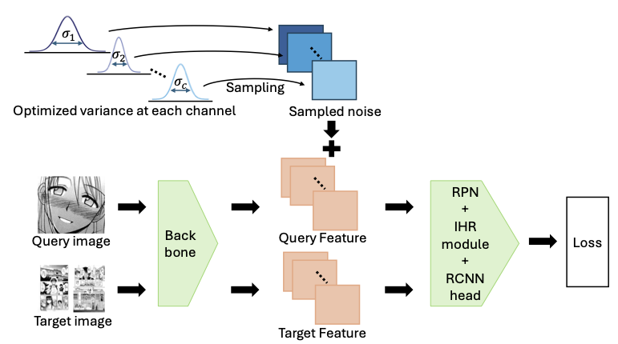

# Learning Gaussian Data Augmentation in Feature Space for One-shot Object Detection in Manga

This repository is an official implementation of the MMAsia 2024 paper "Learning Gaussian Data Augmentation in Feature Space for One-shot Object Detection in Manga", based on [mmdetection](https://github.com/open-mmlab/mmdetection).


## Installation

1. Create a docker virtual environment 

```shell
docker build docker_bhrl/. -t LGDA
docker run -it --shm-size=1g --rm --gpus all -v "{your_folder}:{your_folder}"   --name LGDA  LGDA:latest  /bin/bash 
```

2. Install build requirements and then install MMDetection.

```shell
cd {your_folder}
pip install -v -e . 
```

## Datasets Preparation

When you use Manga109 dataset, please request downloading from [this link](http://www.manga109.org/en/).

We expect the directory structure to be the following:
```
LGDA
├── data
│   ├──manga_dataset
│   │   ├── voc_annotation
│   │   ├── images
├── ref_ann_file
...
```

## Backbone Weight Preparation

Download the ResNet50 model for training from this [link](https://drive.google.com/file/d/1tcRtU-CBu1q00cnnZ6jiF2vvQCzY0a4P/view?usp=sharing).

```
BHRL
├── resnet_model
│   ├──res50_loadfrom.pth
```

## Inference with a pretrained model
```shell
./tools/dist_test.sh ${CONFIG} ${CHECKPOINT} ${GPUS} --out ${RESULTS} --eval bbox --average ${EVALUATION_NUMBER}

# e.g.,
# test unseen classes
./tools/dist_test.sh configs/coco/split1/BHRL.py checkpoints/model_split1.pth 8 --out results.pkl --eval bbox --average 5
# test seen classes
./tools/dist_test.sh configs/coco/split1/BHRL.py checkpoints/model_split1.pth 8 --out results.pkl --eval bbox --average 5 --test_seen_classes
```


## Train a model
```shell
./tools/dist_train.sh ${CONFIG} ${GPUS} --no-validate

# e.g.,
./tools/dist_train.sh configs/coco/split1/BHRL.py 8 --no-validate
```

## Parameter explained
You can change parameters of training in ```/large/ttani_2/bhrl/configs/manga/BHRL_allpairs_mono.py```. For example ,```training_type = "Channel", threshold = 0```


## Citation
If you find our work useful in your research, please consider citing:

```latex
@inproceedings{10.1145/3696409.3700174,
author = {Taniguchi, Takara and Furuta, Ryosuke},
title = {Learning Gaussian Data Augmentation in Feature Space for One-shot Object Detection in Manga},
year = {2024},
isbn = {9798400712739},
publisher = {Association for Computing Machinery},
address = {New York, NY, USA},
url = {https://doi.org/10.1145/3696409.3700174},
doi = {10.1145/3696409.3700174},
booktitle = {Proceedings of the 6th ACM International Conference on Multimedia in Asia},
articleno = {14},
numpages = {8},
keywords = {One-shot object detection, Manga, Data augmentation},
location = {
},
series = {MMAsia '24}
}
```
